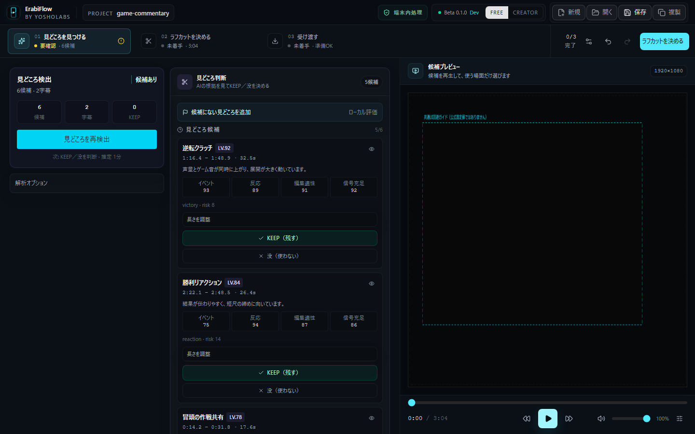

# ErabiFlow Beta

**Version 0.1.0 · Windows 11 x64 · YOSHOLabs**

長尺動画から見どころ候補を整理し、必要な区間を選んでラフカットし、動画編集ソフトへ渡すためのWindows向け編集前工程支援ツールです。



**初回のAI解析には約1.51GiBのモデル取得が必要です。** 動画エンジンと合わせて約1.65GiBを取得します。進捗を確認し、中断・再開できます。通信先が再開に対応しない場合は最初から取得します。

## Download

Betaは公開準備中です。公開後は[公式GitHub Releases](https://github.com/YOSHOLabs/ErabiFlow/releases)から **ErabiFlow-0.1.0-x64.msi** と **SHA256SUMS.txt** を取得してください。

公式対象は **Windows 11 64-bit / x64** です。未署名のため、SmartScreen警告や「不明な発行元」が表示される場合があります。

1. Releaseのファイル名とSHA-256を確認します。[確認・インストール手順](docs/WINDOWS_DISTRIBUTION.md)
2. MSIを実行し、管理者承認後にインストールします。
3. 起動して動画エンジンを取得し、動画を追加します。
4. AI解析時に字幕モデルを取得します。候補と根拠を読み、KEEP／没を選びます。
5. IN／OUT・分割・順番を調整して「受け渡す」へ進みます。
6. MP4と必要なJSON／CSV／EDL／SRTを保存し、編集ソフトで映像・音声・時間を確認します。

[Betaの制限事項](docs/KNOWN_LIMITATIONS.md) · [Privacy](docs/PRIVACY.md) · [利用条件](docs/EULA.md) · [Release Notes](release/RELEASE_NOTES_0.1.0.md) · [不具合を報告](https://github.com/YOSHOLabs/ErabiFlow/issues/new/choose)

不具合報告にはErabiFlowのバージョン、Windowsのバージョン、操作・再現手順、表示されたエラーを記入してください。動画、字幕、個人のファイル名・絶対パスは公開Issueへ貼り付けないでください。セキュリティ問題は[非公開窓口](SECURITY.md)へお願いします。

ErabiFlowは、長時間動画を解析し、見どころ・盛り上がり・不要部分の判断を支援するWindows向けの動画解析・編集支援ツールです。横動画と縦動画の両方を扱い、編集者自身が必要な区間を選択して、任意尺のラフカットを次の動画編集ソフトへ渡せます。

ErabiFlowは動画編集ソフトでも、AIが完成動画を完全自動編集するアプリでもありません。AIは候補と判断根拠を提示し、人がKEEP／没、IN／OUT、順番を決めます。演出、カラー、合成、最終仕上げはPremiere ProやDaVinci Resolveなどへ任せます。

## 主なワークフロー

1. **見どころを見つける**: ローカル解析で候補と根拠を作り、KEEP／没を判断する
2. **ラフカットを決める**: KEEP区間の開始・終了、分割、順番を人が調整する
3. **受け渡す**: 元画角のラフカット動画とJSON／CSV／CMX 3600 EDL／SRTを出力する

現在の主な機能:

- 横・縦・正方形の動画と任意の完成尺
- 音声、字幕、反応、イベント等を使った見どころ候補と判断根拠
- 候補のKEEP／没と判断状態のプロジェクト保存
- 区間の開始・終了調整、分割、並べ替え
- 元画角を維持したラフカット動画
- NLE向けCMX 3600 EDL、汎用JSON／CSV、ラフカット時間軸のSRT
- 端末内での動画・音声・字幕処理

設計判断は[製品戦略](docs/PRODUCT_STRATEGY_2026.md)、[アーキテクチャ](docs/ARCHITECTURE_V2.md)、[既知の制限](docs/KNOWN_LIMITATIONS.md)を参照してください。

## ErabiFlow Beta 0.1.0 の要件

一般ユーザー向けの公開候補はWindows 11 x64用WiX MSIです。ARM64、32-bit Windows、Windows 10は今回の公式対象に含めません。GPUは必須ではなく、一般配布版のAI文字起こしはCPU runtimeを使用します。8GB RAM以上、16GB以上を推奨し、初回setup前に5GB以上の空き容量を確保してください。

アプリの初回準備ではFFmpeg ZIP約138.5MiBとWhisper large-v3-turbo model約1.51GiB、合計最大約1.65GiBをHTTPSで取得します。sizeとSHA-256を検証し、途中fileは`.part`として保持してHTTP Rangeが利用できる場合は再開します。MSI実行時にMicrosoft Edge WebView2 Runtimeが未導入なら、installerがMicrosoftのbootstrapperを取得してsilent installします（この容量は約1.65GiBに含みません）。取得後の動画、音声、字幕、AI候補生成は端末内で行います。

初回公開版はAuthenticode未署名で、自動updaterも無効です。公開後の正規配布元は[GitHub Releases](https://github.com/YOSHOLabs/ErabiFlow/releases)、通常supportは[GitHub Issues](https://github.com/YOSHOLabs/ErabiFlow/issues)です。SmartScreenの「不明な発行元」表示が想定されるため、releaseに掲載するSHA-256を確認してください。

- [Windows要件・install・uninstall・local data削除](docs/WINDOWS_DISTRIBUTION.md)
- [Privacy Policy](docs/PRIVACY.md)
- [一般配布版EULA公開候補](docs/EULA.md)
- [v0.1.0 Release Notes候補](release/RELEASE_NOTES_0.1.0.md)
- [第三者componentのprovenance](docs/THIRD_PARTY_PROVENANCE.md)

## 技術構成

- UI: React 19、TypeScript、Vite、Tailwind CSS 4
- Desktop: Tauri 2、Rust、Tokio
- State: Zustand、Immer、zundo
- Media: FFmpeg、ffprobe、whisper.cpp
- Local analysis sidecar: Python、PyInstaller、JSON Lines IPC
- Vision: MediaPipe Tasks Vision
- Tests: Node.js test runner、Playwright、Rust unit tests、Python unittest

## 開発環境

対象はWindowsです。基準環境は次のとおりです。

- Windows 11 / PowerShell 7
- Node.js 24.13.x / npm 11.x（`.nvmrc`、`package.json`）
- Rust 1.93.0（`rust-toolchain.toml`）
- Python 3.13.x
- Visual Studio 2022 Build Tools「C++によるデスクトップ開発」とWindows SDK
- Microsoft Edge WebView2 Runtime

```powershell
git clone https://github.com/YOSHOLabs/ErabiFlow.git
cd ErabiFlow
npm run setup:dev
npm run tauri dev
```

`setup:dev`はnpm依存、ハッシュ固定済みPython依存、分離した監査環境、固定版whisper.cpp CPUランタイム、Silero VADモデルを準備します。取得物と生成物はGit管理対象外です。

手動セットアップ:

```powershell
npm ci
python -m venv .venv
.\.venv\Scripts\python.exe -m pip install --require-hashes -r python-sidecar\requirements.txt
pwsh -NoProfile -File scripts\bootstrap_dev.ps1 -SkipNpm -SkipPython
```

開発起動ではFFmpegをリポジトリへ同梱しません。初回利用時に`release/ffmpeg-source.json`で固定した配布元から取得し、サイズとSHA-256を検証します。Whisperモデルも必要時に取得します。動画、音声、字幕を解析のために外部サービスへ送信しません。

フロントエンドだけを確認する場合:

```powershell
npm run dev
```

`http://127.0.0.1:1420/?demo=1`はサンプル編集状態、`?demo=review`は候補レビュー状態です。ブラウザdemoはTauri IPC、実FFmpeg、Python sidecarの動作確認にはなりません。

## 検証

```powershell
npm test
npm run build
npm run test:e2e
npm run test:e2e:release
npm run audit:dependencies
npm run audit:licenses
cargo fmt --manifest-path src-tauri\Cargo.toml -- --check
cargo clippy --manifest-path src-tauri\Cargo.toml --all-targets -- -D warnings
cargo test --manifest-path src-tauri\Cargo.toml
.\.venv\Scripts\python.exe -m unittest discover -s python-sidecar\tests -p "test_*.py"
npm run check:repo -- -AllowDirty
```

Python sidecarの配布用生成まで確認する場合は`npm run build:sidecar`を実行します。軽量Windowsビルドのソースは`build_release_lite.bat`にありますが、更新署名鍵とパスワードはリポジトリ外の入力です。生成されるEXE／MSIはGitへ追加しません。

実動画、GPU別経路、MSI、clean Windows PCでのinstall/uninstallは環境依存の手動確認です。ソースのGitHub公開判定と一般ユーザー向けバイナリ配布判定は分離します。

## 主なディレクトリ

```text
src/                    React UI、状態管理、純粋ロジック、Canvas preview
src-tauri/              Rust/Tauri、FFmpeg、path security、runtime取得
python-sidecar/         ローカル解析daemonとpipeline
e2e/                    アプリのブラウザdemo E2E
e2e-release/            production frontend表示のE2E
scripts/                setup、監査、desktop build補助
release/                外部runtimeの固定URL・size・SHA-256等の公開情報
docs/                   アーキテクチャ、製品方針、provenance
```

公開リポジトリにはWebサイト、private beta資産、インストーラー、テスト／ユーザー動画、FFmpeg、Whisperモデル、Python／Node／Rustの生成物、鍵、証明書、recovery／feedbackデータを含めません。

## 第三者コンポーネント

第三者ライブラリ、WASM、モデル、外部runtimeはそれぞれのライセンスに従います。直接追跡するMediaPipe資産と取得時runtimeの出所・hashは[THIRD_PARTY_PROVENANCE](docs/THIRD_PARTY_PROVENANCE.md)、通知本文は[src-tauri/resources/THIRD_PARTY_NOTICES.txt](src-tauri/resources/THIRD_PARTY_NOTICES.txt)を参照してください。

依存license一覧は正確なlockfileとインストール環境から`npm run licenses:bundle`で生成し、配布ビルドへ含めます。生成ファイル自体はGit管理しません。

## ソースコードの権利

Copyright © 2026 YOSHOLabs. All Rights Reserved.

このPublic repositoryはポートフォリオ、技術確認、セキュリティレビュー、評価のためにソースを閲覧可能にするものです。ErabiFlow本体はOSSではなく、MIT／GPL／Apache等では提供していません。限定されたローカル評価権と禁止事項は[LICENSE](LICENSE)を確認してください。第三者コンポーネントには各元ライセンスが別に適用されます。

一般配布版ErabiFlowの[EULA公開候補](docs/EULA.md)は、GitHub上のsource codeの権利条件と分離しています。準拠法、裁判管轄、事業者表示、責任上限は公開前の事業判断・専門家レビューが必要です。

## セキュリティとコントリビューション

- 脆弱性報告: [SECURITY.md](SECURITY.md)
- 開発とPull Request: [CONTRIBUTING.md](CONTRIBUTING.md)
- ブランド資産: [TRADEMARKS.md](TRADEMARKS.md)
- Public公開手順: [docs/PUBLIC_REPOSITORY_RELEASE.md](docs/PUBLIC_REPOSITORY_RELEASE.md)
