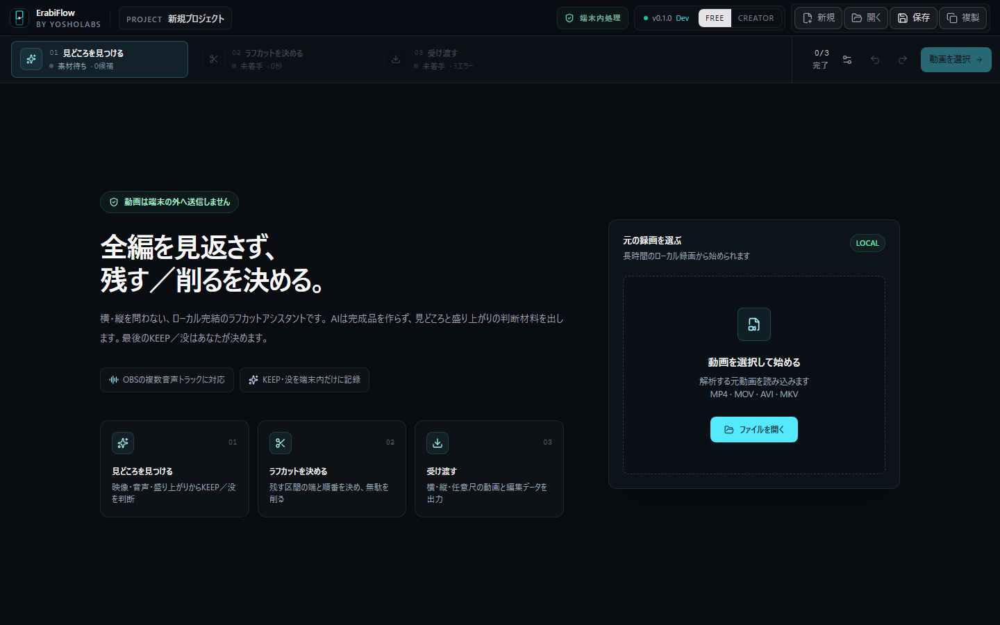
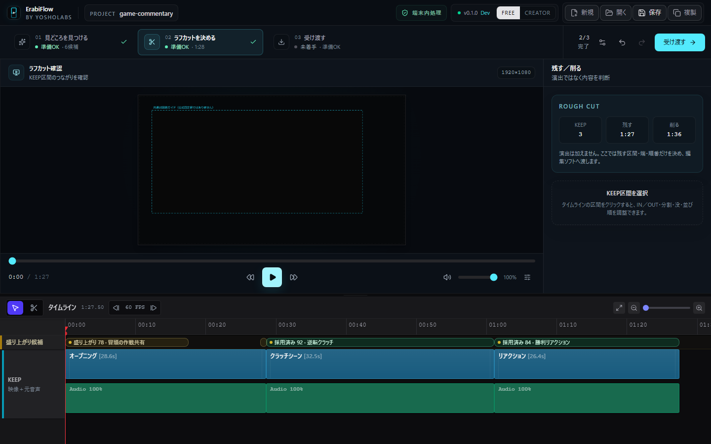
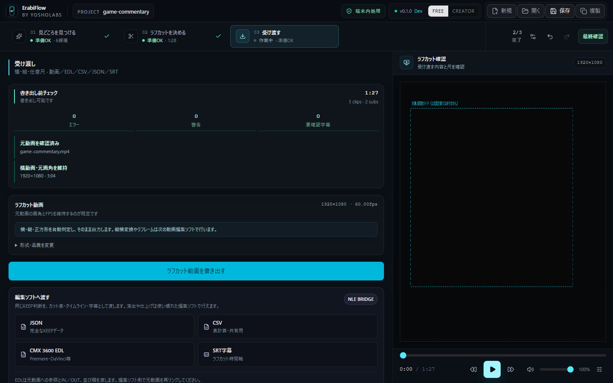

# CloudWorks掲載用 — ErabiFlow

## 作品名

ErabiFlow

## 一言説明

長尺動画の見どころ候補と根拠を提示し、人がKEEP／没を選んで編集ソフトへ渡せるWindows向け動画解析・編集支援ツールです。

## 詳細説明

長時間の収録素材から使える場面を探すには、全編を見返しながら残す区間と削る区間を判断する必要があります。ErabiFlowは動画をローカル環境で解析し、音量、反応、映像変化などを根拠に見どころ・盛り上がりの候補を提示します。

候補をそのまま自動採用するのではなく、利用者が映像と根拠を確認してKEEP／没を決定します。採用した区間はIN／OUT、分割、順番を調整でき、横動画・縦動画の元画角を保った任意尺のラフカットとしてまとめられます。結果はラフカット動画に加え、JSON、CSV、CMX 3600 EDL、SRTでPremiere ProやDaVinci ResolveなどのNLEへ受け渡せます。

完成映像の演出やカラー調整を自動で行う動画編集ソフトではありません。素材選別と編集判断の負担を減らし、本格的な編集工程へつなぐための支援ツールです。

## 担当範囲

個人開発として、企画、課題整理、要件定義、UI／UX設計、アーキテクチャ設計、AIコーディングを活用した実装、テスト設計・実行、GitHub ActionsによるCI、公開リポジトリ整備、secret scan、依存関係・脆弱性・ライセンス監査まで担当しました。

## 技術スタック

- React 19 / TypeScript / Vite / Tailwind CSS
- Zustand / Immer
- Tauri 2 / Rust / Tokio
- Python 3.13 / PyInstaller
- FFmpeg / ffprobe
- whisper.cpp / Silero VAD（Vulkan・CUDA対応runtimeは任意、CPU fallbackあり）
- MediaPipe Tasks Vision
- Playwright / Node.js test runner / Rust unit tests / Python unittest
- GitHub Actions / Dependabot / gitleaks

## 主な機能

- 横・縦を問わない長尺動画のローカル解析
- 見どころ候補、盛り上がり度、判断根拠の提示
- 候補ごとのKEEP／没判断と判断状態のプロジェクト保存
- 元動画を確認しながら行うIN／OUT調整、分割、並び替え
- 元画角を維持した任意尺ラフカット動画の書き出し
- JSON / CSV / CMX 3600 EDL / SRTによるNLE連携
- FFmpeg・モデルの取得時ハッシュ検証、出力パス検証、復旧保存
- TypeScript、Rust、Python、Playwrightを横断した自動テストとCI

## GitHub

https://github.com/YOSHOLabs/ErabiFlow

ソースコードは技術確認・評価目的で公開しています。ErabiFlow本体はOSSではなく、権利条件はリポジトリのLICENSEに記載しています。

## 掲載画像の推奨順

1. `portfolio-01-overview.png` — ErabiFlowの3工程と全体像
2. `portfolio-02-highlight-review.png` — 候補、判断根拠、KEEP／没
3. `portfolio-03-rough-cut.png` — 採用区間とIN／OUT調整
4. `portfolio-04-handoff.png` — ラフカット動画とNLE向け4形式の受け渡し

画像の説明文は、それぞれ「素材を解析」「人が選ぶ」「ラフカットを整える」「編集ソフトへ渡す」とすると、完全自動編集ではない製品価値を順番に伝えられます。

